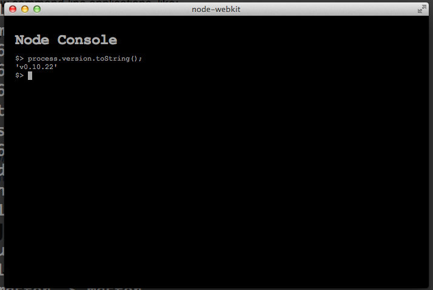

# Node Console

A nodejs repl/console app.

## Why

Wouldn't be nice to have a simple consistent console application that 
gave you direct access to the node repl.  Why not create a console,
that defaults you in the node repl, but if you need to run
a couple of console commands you can do that as well.

This is not trying to replace bash or others, it is more of an
experiment and consistent console experience that runs the same on every platform.

## Usage

Just use like the node repl, it should have multi-line support and uses
jshint to validate the javascript, but you should be able to run a
http server, or client, or custom test, etc.

Also you can execute a few command-line applications, like:

`npm, ls, dir, mkdir, cp, mv`

We may add more as time goes on, the point is to work for all operating
system environments.

## Install

* MAC - Download -> https://s3.amazonaws.com/node-console/console-0.1.0-mac.zip
* WIN - Download -> https://s3.amazonaws.com/node-console/console-0.1.0-win.zip
* linux64 - Download -> https://s3.amazonaws.com/node-console/console-0.1.0-linux63.zip

## Contributing

pull requests are welcome.

